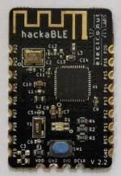
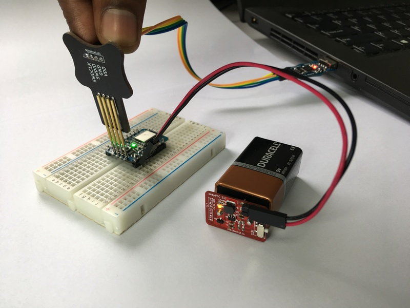

# What is hackaBLE ?

**hackaBLE** is a tiny (~ 18 mm x 28 mm) Open Source Nordic nRF52832 based BLE development board you can embed in your BLE projects. It's designed such that you can use it in three ways:

- On a breadboard
- On a custom PCB, hand-soldered easily using the castellated 2.54 mm pitch headers
- On a custom PCB, using a stencil and oven, making use of extra pads underneath the PCB

hackaBLE uses offers more value than just using the BLE module directly - since it incorporates the necessary passive components - including the ones for the buck converter for power saving - and adds an RGB LED and a button for convenience. It's also much easier to solder than the bare modules. 

**Features**

- Raytac MDBT42 based on Nordic Semiconductor's nRF52832 SOC with chip antenna
- RGB LED
- Button user configurable, set as RESET as default
- SWD programming headers
- MCP1702 3.3 V LDO
- Reverse current protection.

## Getting Started

Currently, there are two versions available in the market. Select your version of hackaBLE from below and follow the documentation. 

<h3><a href="#hackaBLE_v0.3">hackaBLE v0.3</a></h3>

<h3><a href="#hackaBLE_v2.2">hackaBLE v2.2</a></h3>

<h1 id="hackaBLE_v0.3"> hackaBLE v0.3 </h1>

This is the latest version of hackaBLE it uses nRF52832 Nordic Semiconductor's module. This version is used MCP1702, a 3.3 V voltage and protection diode at the input which provides very low current consumption and reverse current protection. It also comes with an RGB LED, user reset button and SWD programming headers.  

### Pinout for hackaBLE

## PCB Footprint for hackaBLE

(The kicad footprint for hackaBLE is readily available in this repository.)

<h1 id="#Programming hackaBLE"> Programming hackaBLE </h1>

hackaBLE uses the Nordic nRF52832 which in turn is based on an ARM Cortex-M4 core. So you can really program it with any ARM compatible programmer. We do have a convenient solution though, in the form of our [Bumpy][3] Blackmagic probe compatible SWD debugger and our [PogoProg][4].

As shown above, use the four SWD pins of PogoProg on hackaBLE to upload or debug hackaBLE.

Please [read the bumpy documentation][3] on using Bumpy to program hackaBLE.

For more details on nRF52 programming, please read our guide on [getting started with Nordic nRF5 SDK][1].

## Program using Arduino IDE

hackable does not ship with a bootloader, but it is supported in Arduino. Please see https://github.com/electronut/ElectronutLabs-bluey#Arduino for details (but select Hackable in the board's menu).

[Here's](https://electronut.in/using-hackable-with-arduino/) a blog article which will help you create a BLE custom characteristic and program it to hackaBLE using Arduino IDE.

## Soldering a hackaBLE

hackaBLE can be used on a breadboard. Here's a video that will show how to solder headers on to hackaBLE.

<h2 id="hackaBLE_v2.2"> hackaBLE v2.2 </h2>

hackaBLE v2.2 is a redesigned hackaBLE that used the BLE SoC directly rather than a module. This version of hackaBLE also comes with an RGB LED, button, and SWD programming headers. It has onboard BLE antenna. 

**[CAUTION]** hackaBLE v2.2 does not come with a regulator since it's designed for low power applications. MAX input to VDD is 3.6 V.

## hackaBLE v2.2 pinout

## Programming hackaBLE v2.2

Programming hackaBLE is same as v0.3. Please follow the instructions above.

## Buy a hackaBLE!

hackaBLE is available for purchase from our [Tindie store][2]. Please email us at **info@electronut.in** if you have any questions.

[1]: https://github.com/electronut/ElectronutLabs-bluey/blob/master/nrf5-sdk-setup.md
[2]: https://www.tindie.com/stores/ElectronutLabs/
[3]: https://github.com/electronut/ElectronutLabs-Bumpy
[4]: https://github.com/electronut/ElectronutLabs-PogoProg
 
 
